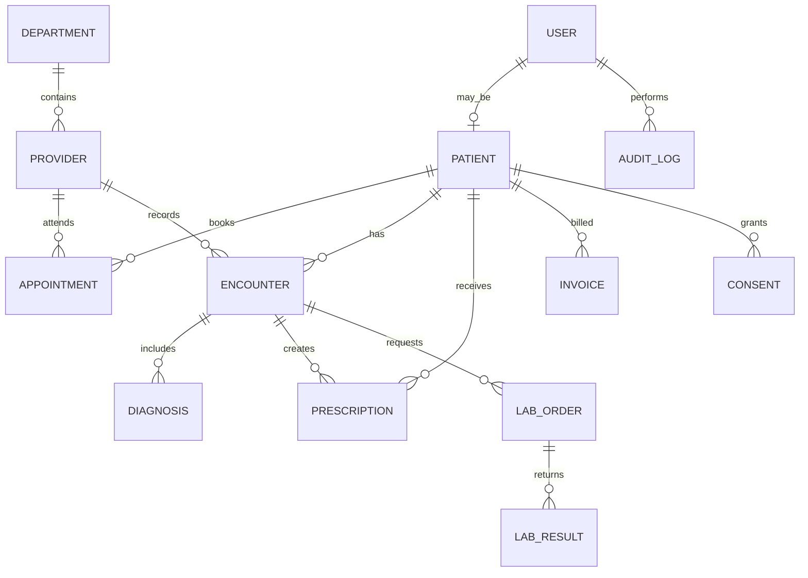

# Entity relationship model

```mermaid
erDiagram
  USER ||--o| PATIENT : may_be
  DEPARTMENT ||--o{ PROVIDER : contains
  PATIENT ||--o{ APPOINTMENT : books
  PROVIDER ||--o{ APPOINTMENT : attends
  PATIENT ||--o{ ENCOUNTER : has
  PROVIDER ||--o{ ENCOUNTER : records
  ENCOUNTER ||--o{ DIAGNOSIS : includes
  ENCOUNTER ||--o{ PRESCRIPTION : creates
  PATIENT ||--o{ PRESCRIPTION : receives
  ENCOUNTER ||--o{ LAB_ORDER : requests
  LAB_ORDER ||--o{ LAB_RESULT : returns
  PATIENT ||--o{ INVOICE : billed
  PATIENT ||--o{ CONSENT : grants
  USER ||--o{ AUDIT_LOG : performs
```

See `apps/api/prisma/schema.prisma` for the executable schema, enums, foreign keys and indexes.
